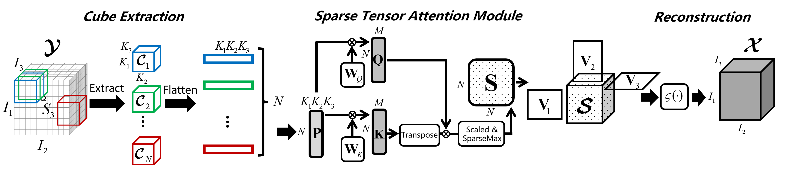
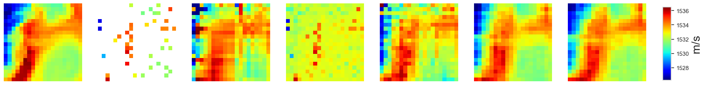

# FieldFormer: Self-supervised Reconstruction of Physical Fields via Tensor Attention Prior

Official implementaion for the  paper entitled  "**FieldFormer: Self-supervised Reconstruction of Physical Fields via Tensor Attention Prior**"[[Arxiv](https://arxiv.org/pdf/2505.09284)], published in IEEE Transactions on Signal Processing. 

## Key Idea:
Build a complexity-adaptive Tucker model based on attention mechanism for reconstructing field with sparse observations.
<p align='center' style="background-color:white;" >
    
    </br>
    <figurecaption style='color: black'>The schematic figure illustrating the rationale of the proposed method.</figurecaption>
</p>
</br>


## Proposed Method:
<p align='center' style="background-color:white;" >
    
    </br>
    <figurecaption style='color: black'>The detailed architecture of our proposed tensor attention prior (TAP) model for reconstructing 3D physical fields with
limited observations.</figurecaption>
</p>
</br>

## Results:
<p align='center' style="background-color:white;" >
    
    </br>
</p>
</br>
<p align='center' style="background-color:white;" >
    
    </br>
</p>
</br>
<p align='center' style="background-color:white;" >
    
    </br>
    <figurecaption style='color: black'>Visualizations of ground-truth, observation and reconstructed Sound Speed Field data of various methods at depth 0m (top), 90m (middle) and 190m (bottom).</figurecaption>
</p>
</br>


## Requirements:
The code was built with the `python3.10`. The detailed package info can be found in `requirement.txt`.


## Usage:
 Sample demonstration of the proposed method in the paper is available in `experiments/demo.py`. 


## Citing FieldFormer:
🌟 If you find this resource helpful, please consider to star this repository and cite our research:

```tex

```
In case of any questions, bugs, suggestions or improvements, please feel free to open an issue.
